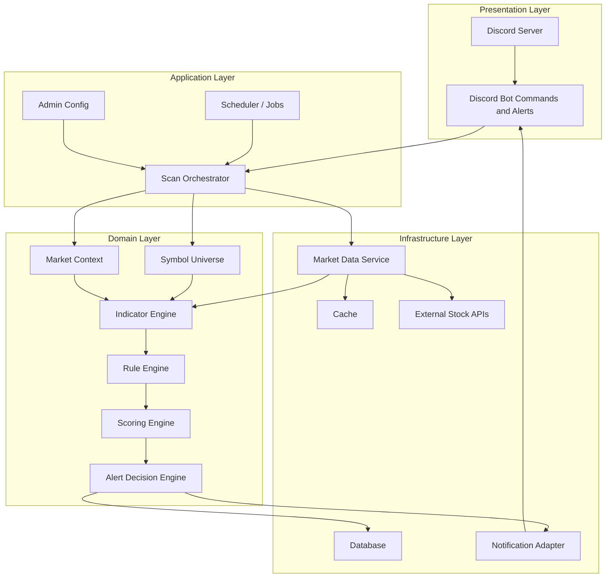

```mermaid
flowchart TB
    subgraph Presentation[Presentation Layer]
        A[Discord Server]
        B[Discord Bot Commands and Alerts]
    end

    subgraph Application[Application Layer]
        C[Scheduler / Jobs]
        D[Scan Orchestrator]
        E[Admin Config]
    end

    subgraph Domain[Domain Layer]
        F[Symbol Universe]
        G[Market Context]
        H[Indicator Engine]
        I[Rule Engine]
        J[Scoring Engine]
        K[Alert Decision Engine]
    end

    subgraph Infrastructure[Infrastructure Layer]
        L[Market Data Service]
        M[Cache]
        N[External Stock APIs]
        O[Database]
        P[Notification Adapter]
    end

    A --> B
    B --> D
    C --> D
    E --> D

    D --> F
    D --> G
    D --> L

    L --> M
    L --> N

    F --> H
    G --> H
    L --> H

    H --> I
    I --> J
    J --> K

    K --> O
    K --> P
    P --> B
```
